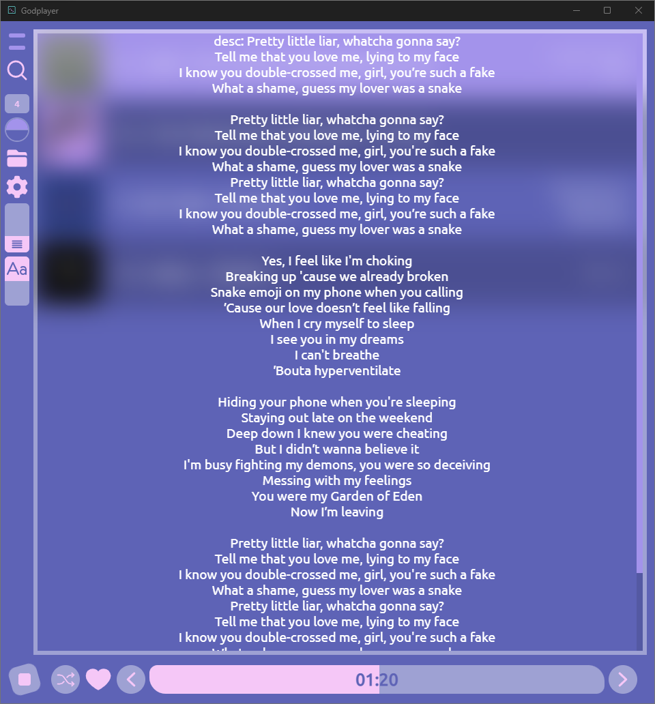

# GodPlayer

## Introduction

**GodPlayer** is a sleek and user-friendly music player that's ready to use right out of the box. It's built with **Tauri** and **Solid-JS**, offering a customizable and efficient experience for Windows users.

## Notes

- **Default Music Folder**: Automatically set to the user's music folder, which can be changed in the settings.
- **Administrator Rights**: If the app crashes, try running it as an administrator.

## Build App

### Internet required

To build the app, you'll need an internet connection. Follow these steps:
1. Open a command prompt in the source folder.
2. Run `npm install`.
3. Navigate to the `src-tauri` directory with `cd src-tauri`.
4. Execute `cargo tauri build`.
5. Wait for the process to complete, which may take some time.
6. The built application will be located in `src-tauri/target/release/bundle/msi`.

## Screenshots

