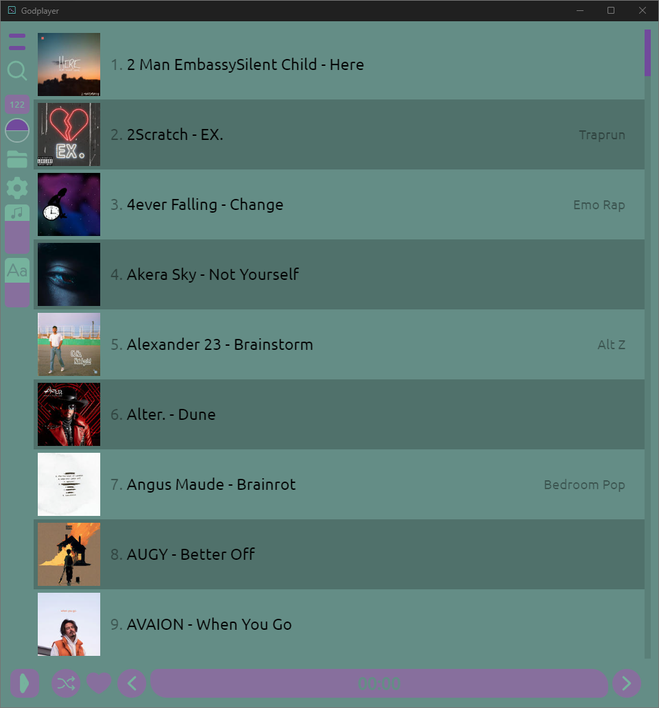

# GodPlayer

Fancy music player ready to use built with Tauri + Solid-JS

## Notes

* **Default folder** is user music folder that you can modify in settings

* ! If app crashes, run the app as administrator and try again

## Build App

### Internet required

1. Open command in source folder then run
2. `npm install` then `cd src-tauri` then `cargo tauri build`
3. wait till complete (might take a while)
4. the bundle build is in `godplayer-windows\src-tauri\target\release\bundle\msi`

## Screenshots

